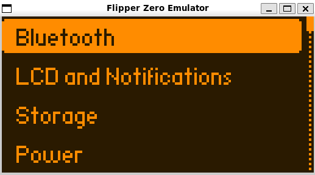
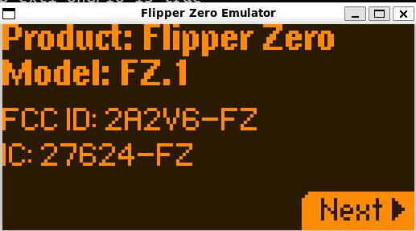
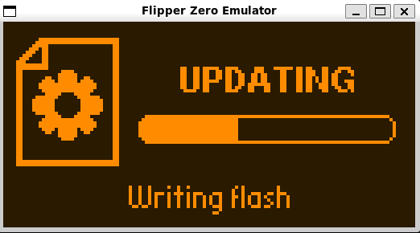
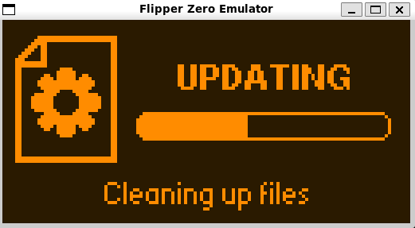
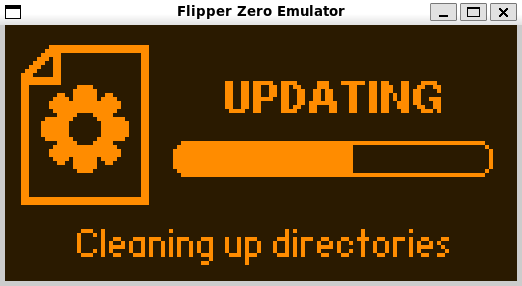
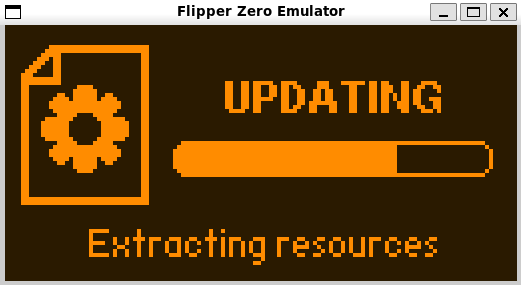
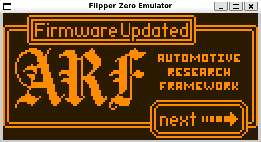

# Flipper Zero Full-System Emulator (STM32WB55RG)

Runs **real, unmodified Flipper Zero firmware** on an emulated STM32WB55 chip
using [Renode](https://renode.io). **No physical Flipper required.**

The emulated hardware is faithful enough that a **stock `firmware.bin`** — the
exact image you would flash to a real device — boots straight to the desktop:
the SD card mounts and reads/writes, the dolphin animates, the buttons work, and
the debug console is available over TCP. You can also **install a third-party
firmware `.tgz`** through the stock updater, exactly like qFlipper does over USB.

> **No firmware patches, no special build flags.** Plain release firmware runs
> as-is. See `DIAGNOSIS.md` for how each peripheral was made faithful.

The internal flash is now **non-volatile** (a real disk-backed image), just like
the chip on a real device: whatever you flash — stock, a different `.bin`, or a
firmware installed by the OTA updater — **stays flashed across reboots and even
across separate runs**, and the emulator boots it on its own.

The radios come up like **present chips**: SubGHz (CC1101) reports
`[I][FuriHalSubGhz] Init OK`, and NFC (ST25R3916) is **recognized** (chip id
`0x28`). They are **not** signal-accurate — there is no RF over the air; SPI/GPIO
traffic is logged to JSONL. RFID is modeled via the comparators (COMP1/COMP2),
IR is non-hanging, and the BLE Core2 radio stack is *emulated well enough for the
OTA updater* but does not run real Bluetooth. Everything else is the real firmware.

---

## Screenshots

| | |
|:---:|:---:|
|  | ) |
| | |
|  |  |
| | |
|  |  |
| | |
|  |  |
| | |
|  |  |
| | |

## 0. TL;DR (just make it run)

This repo ships **ready-to-run patched Renode binaries** for Linux **x86_64** and
**arm64** (in `tools/renode-prebuilt/`), plus the **full patched Renode source**
(in `third_party/renode-src/`) so it can be rebuilt for any OS. `install.sh`
picks the right prebuilt for your machine automatically — no build needed in the
common case.

```bash
cd flipper-emulator
./install.sh          # installs deps + the matching prebuilt patched Renode
./setup.sh            # one time (and every time you move the folder)
./run.sh              # boots the firmware; an SDL window opens
```

Wait ~15–30 s. The dolphin appears. **Click the window**, press **Enter** = OK.

Install a custom firmware over-the-air (like a real USB update):

```bash
./run.sh --with-update /path/to/flipper-z-f7-update-XXXX.tgz
```

It takes a few minutes and reboots itself several times (exactly like a real
Flipper), then boots the new firmware. Afterwards a plain `./run.sh` keeps
booting the firmware you installed (the flash is persistent).

> **On an unusual arch / no prebuilt?** `./install.sh` builds the patched Renode
> from the shipped source for your machine (~10–40 min, needs .NET 8 + cmake/gcc,
> all bootstrapped for you). Force it with `./install.sh --force-build`.
>
> **Buttons need a real graphical desktop** and the SDL window must be
> **clicked/focused**. Over pure SSH the window can't receive keystrokes.

To install a custom firmware `.tgz` (like a real over-USB update):

```bash
./run.sh --with-update /path/to/flipper-z-f7-update-XXXX.tgz
```

Be patient — a full update takes **a few minutes** (it flashes ~200 pages and
copies a big resources archive). The device **reboots several times on its own
during the update** — that is normal, exactly like a physical Flipper. When it
finishes it boots the newly installed firmware.

---

## 1. What you need

- **Linux** — native, or **WSL2** on Windows. A real graphical desktop session
  is needed for the SDL window and its buttons (see the buttons note below).
- **Python 3** with `pip`
- **bash**, `mtools`, `dosfstools` — installed by `./install.sh`.
- ~1 GB free disk for the prebuilt path (plus a sparse SD image). Building Renode
  from source (only if there is no prebuilt for your arch) needs ~4 GB and
  internet the first time.

> **Why a patched Renode?**
> The emulator needs a small patch to Renode that makes the STM32WB55 internal
> flash **non-volatile** (backed by a file on disk, written through on every
> write). Without it, a firmware you flash — or install via OTA — would vanish
> when the emulator exits, and the device would always boot the old firmware.
> This repo ships the patched Renode **prebuilt** (x86_64 + arm64) and as
> **source** (`third_party/renode-src/`, patch pre-applied) so it can be rebuilt
> for any OS. See `DIAGNOSIS.md` Part II for the full story.

---

## 2. Install (once)

```bash
./install.sh
```

This will:
- install system packages (`dosfstools`, `mtools`, `python3`) via `apt`,
- install the **matching prebuilt patched Renode** for your architecture into
  `./tools/renode` (instant; from `tools/renode-prebuilt/`),
  - if there is no prebuilt for your arch, it **builds from the shipped source**
    (`third_party/renode-src/`) instead — bootstrapping **.NET 8 SDK** and using
    `cmake`/`gcc` (~10–40 min),
- install the Python packages (`PySDL2`, `pysdl2-dll`, `Pillow`, `heatshrink2`).

Useful flags:

| Command | What it does |
|---|---|
| `./install.sh` | Install deps + the matching prebuilt patched Renode. |
| `./install.sh --with-firmware` | Also download the latest official release `.bin` into `firmware/`. |
| `./install.sh --force-build` | Ignore the prebuilt; build patched Renode from the shipped source. |
| `./install.sh --rebuild-renode` | Wipe the install and rebuild from the shipped source. |
| `./install.sh --skip-renode-build` | You already have a patched `tools/renode` — don't touch it. |
| `RENODE_ALLOW_OFFICIAL=1 ./install.sh` | If a source build fails, fall back to the official Renode (⚠️ **no flash persistence** — OTA/custom firmware won't stick). |

> If `pip` complains about an "externally managed environment", the script
> already passes `--break-system-packages`. If it still fails:
> `pip install --break-system-packages PySDL2 pysdl2-dll Pillow heatshrink2`

---

## 3. Set up this machine (once, or after moving the folder)

```bash
./setup.sh
```

This:
- generates the machine-specific `platform/*.repl` and `scripts/*.resc` from
  their `.in` templates (they contain absolute paths, so **re-run after moving
  the folder**),
- creates the **non-volatile internal flash image** `firmware/flash.img` (1 MB)
  seeded from the bundled stock firmware,
- creates a **32 GB FAT32** SD-card image `sdcard/sdcard.img` filled with the
  firmware resources (NFC/IR/SubGHz databases, apps, dolphin animations) and a
  `/.int` folder for internal settings. The image is **sparse** (it does not
  really use 32 GB on disk).

---

## 4. Run stock firmware

```bash
./run.sh
```

- An **SDL window** opens showing the 128×64 display (needs the Python SDL
  packages; otherwise use headless mode below).
- Wait **~15–30 s** for boot. The **dolphin** appears on the idle desktop.

The emulator boots **whatever is currently in `firmware/flash.img`**. Options:

| Command | What it does |
|---|---|
| `./run.sh` | Boot the current flash image (persists between runs). |
| `./run.sh firmware/some-firmware.bin` | **Reflash the chip** with that `.bin`, then boot it. |
| `./run.sh --reset-flash` | Reflash with the bundled stock firmware, then boot it. |
| `./run.sh --no-gui` | No SDL window (use the headless viewer). |
| `./run.sh --headless` | No window at all (for SSH / CI). |

---

## 5. Press buttons (SDL window)

**Click the SDL window first to give it keyboard focus**, then:

| PC key            | Flipper button |
|-------------------|----------------|
| Arrow keys        | Up / Down / Left / Right |
| Enter             | OK |
| Backspace / Esc   | Back |
| Q                 | quit the frontend |

Press **Enter (OK)** on the desktop to open the main menu.

> **Buttons do nothing?** The SDL window must have **keyboard focus** (click it),
> and you must be on a real graphical desktop. Over pure SSH with no display the
> window can't receive keystrokes — the frontend prints a warning about this. Use
> headless button injection instead (see section 8).

---

## 6. Watch the firmware log (optional but useful)

In a second terminal:

```bash
telnet localhost 3456
```

This is the firmware's real USART1 debug console (230400 baud). You'll see the
boot log and app messages. Some `[E]` lines are **normal** (battery gauge,
Core2/BLE) — see the table at the bottom.

---

## 7. Method B — install a firmware `.tgz` (OTA update, like qFlipper)

This reproduces the **real over-the-air update flow**: the stock updater unpacks
the `.tgz`, checks the radio stack and option bytes, writes the new firmware to
internal flash, installs resources to the SD, and reboots into the new firmware.

### Step 1 — get an update package

Download an official-style update `.tgz` for the **f7** target (e.g. a custom
firmware release). It looks like `flipper-z-f7-update-<name>.tgz` and contains
`firmware.dfu`, `resources.ths`, `update.fuf`, `updater.bin`, `radio.bin`,
`splash.bin`, etc.

### Step 2 — run the updater flow

```bash
./run.sh --with-update /path/to/flipper-z-f7-update-<name>.tgz
```

What happens (watch it on `telnet localhost 3456` and in the SDL window):
- the package is staged onto the SD image under `/ext/update/…`,
- boot mode is set to **Update**, the updater runs from RAM,
- it validates the radio stack (reported already-installed → skipped, no BLE
  hardware needed) and option bytes, then **flashes the firmware** and installs
  resources,
- the device **reboots several times on its own** and finally boots the freshly
  installed firmware (custom logo / slideshow / desktop for firmwares that ship
  one).

> **Be patient.** A full update takes **a few minutes** in the emulator
> (flashing ~200 flash pages plus copying a large resources archive). The
> progress bar can sit on a stage for a while — that is normal, not a hang. On a
> real Flipper the same update also reboots multiple times and takes a while.

### Step 3 — after the update

The new firmware now lives in the **persistent** `firmware/flash.img`, so plain
`./run.sh` (without `--with-update`) boots the firmware you just installed. To go
back to stock: `./run.sh --reset-flash`.

---

## 8. Headless mode (no window / over SSH)

No SDL window? Use the ASCII/PNG viewer:

```bash
./run.sh --no-gui &
python3 frontend/view_display.py --watch         # live ASCII view in the terminal
python3 frontend/view_display.py --png shot.png   # save a PNG snapshot
```

Inject buttons manually via the Renode monitor (default port 1234):

```bash
echo "gpioPortH OnGPIO 3 true"  | nc -q0 localhost 1234   # OK press
echo "gpioPortH OnGPIO 3 false" | nc -q0 localhost 1234   # OK release
```

Button → GPIO map: **Up=PB10, Down=PC6, Left=PB11, Right=PB12, OK=PH3, Back=PC13.**
Active-low buttons: pressed = `false`, released = `true`.
OK (PH3, active-high): pressed = `true`, released = `false`.

---

## 9. Troubleshooting (read this before panicking)

| Symptom | Cause & fix |
|---|---|
| `install.sh` is slow | It builds Renode from source (needed for flash persistence). One-time, ~10–40 min. |
| `Renode not found` / build failed | Ensure `.NET 8`, `cmake`, `gcc`, `g++`, `make`, `git` are installed and you have internet. Re-run `./install.sh`. As a last resort `RENODE_ALLOW_OFFICIAL=1 ./install.sh` (⚠️ loses flash persistence). |
| No window / `No module named sdl2` | `pip install --break-system-packages PySDL2 pysdl2-dll Pillow`, or use headless mode. |
| Blank screen for a while | Normal — wait ~15–30 s for boot. |
| Buttons don't work | **Click the SDL window to focus it.** You must be on a graphical desktop (not pure SSH). Headless? use section 8. |
| Boots into DFU/recovery | A button reads as pressed. `run.sh` sets buttons idle automatically; if you launch Renode by hand, drive PB10/PB11/PB12/PC6/PC13 **HIGH** and PH3 **LOW** before `start`. |
| `Port 3456/1234 already in use` | A previous run is still alive: `pkill -9 -f renode`. |
| OTA update seems stuck | Updates take **a few minutes** and reboot several times. Give it time; watch `telnet localhost 3456` for stage progress (`Stage N, progress M`). |
| Custom firmware didn't stick after update | Make sure `install.sh` built the **patched** Renode (flash persistence). Check `tools/renode/.patched` exists. Without the patch, the flash is volatile. |
| I moved the folder and it broke | Re-run `./setup.sh` (the `.repl`/`.resc` files contain absolute paths). |
| `[E][Gauge]`, `[E][Core2]` in the log | **Expected** on a normal boot. The battery gauge and live BLE are intentionally absent; the firmware logs and continues. |

---

## 10. Repository layout

```
flipper-emulator/
├── install.sh          # builds patched Renode from source + installs deps
├── setup.sh            # per-machine setup: generates .repl/.resc, flash.img, SD image
├── run.sh              # launcher (boot flash, reflash a .bin, or --with-update TGZ)
├── firmware/
│   ├── flipper-z-f7-full.bin   # bundled STOCK firmware (unpatched)
│   ├── flash.img               # NON-VOLATILE internal flash image (generated)
│   └── resources.ths           # firmware resources laid onto the SD
├── frontend/
│   ├── sdl_frontend.py         # SDL2 window + keyboard→button injection
│   └── view_display.py         # headless ASCII / PNG viewer
├── peripherals/        # custom Renode peripheral models (see DIAGNOSIS.md)
│   ├── IPCC_WB55.cs            # Core2/BLE mailbox: fakes "radio stack installed" for OTA
│   ├── hsem_wb55.py           # hardware semaphores (flash/Core2 coordination)
│   ├── SYSCFG_WB55.cs         # EXTI mux + MEMRMP (updater runs from RAM)
│   └── flash_controller_wb55.py, ...
├── platform/           # STM32WB55 platform description (.repl / .repl.in)
├── scripts/            # Renode launch scripts + SD-image builder
├── sdcard/             # 32 GB FAT32 SD image (generated, sparse)
├── logs/               # SubGHz/NFC JSONL transaction logs
├── third_party/
│   └── renode-src/            # FULL Renode v1.16.1 source, persistence patch
│                              #   pre-applied — build for any OS with install.sh
└── tools/
    ├── renode/                # the patched Renode in use (installed by install.sh)
    ├── renode-prebuilt/       # ready-to-run patched Renode: linux-x64 + linux-arm64
    └── renode-patches/        # the flash-persistence patch (for reference/rebuild)
```

> **Renode is patched and included two ways:** ready-to-run prebuilts in
> `tools/renode-prebuilt/` (x86_64 + arm64) and full source in
> `third_party/renode-src/` (patch pre-applied). `install.sh` uses the prebuilt
> for your arch, or builds the source if none matches. The one-line patch summary
> is in `tools/renode-patches/`; the full engineering story is in `DIAGNOSIS.md`
> Part II.

---

## 11. What is and isn't emulated

**Works (real firmware, faithful hardware):**
- STM32WB55 Cortex-M4 CPU, RCC/PWR/RTC/EXTI/DMA/timers
- ST7567 128×64 display (rendered to the SDL window)
- Buttons (via SYSCFG-routed EXTI)
- microSD over SPI2 + DMA — mount, read, **write**, apps, OTA updater
- **Non-volatile internal flash** (`firmware/flash.img`) — persists across runs
- `/int` internal settings (redirected to `/ext/.int` on the SD)
- USART1 debug console, USB CDC enumeration path
- **OTA firmware update** from a `.tgz` (radio stack + option bytes validated,
  firmware flashed, resources installed, reboots into the new firmware)

**Init like present chips, but no RF over the air (logged to JSONL):**
- SubGHz (CC1101) — self-test passes, `[I][FuriHalSubGhz] Init OK`
- NFC (ST25R3916) — recognized (chip id `0x28`)
- RFID — via the comparators (COMP1/COMP2)
- Infrared — modeled non-hanging

**Emulated for the updater only / not real RF:**
- BLE Core2 radio stack — the closed ST coprocessor is not run; its IPCC/SHCI
  "ready" handshake and installed-stack version are emulated **only during an OTA
  update** so the updater validates and skips re-flashing the radio. On a normal
  boot BLE is reported absent (non-fatal).

**Absent (intentional):**
- Battery gauge (bq27220) / charger (bq25896) — the PC has no real battery.

See **`DIAGNOSIS.md`** for the full engineering breakdown.
