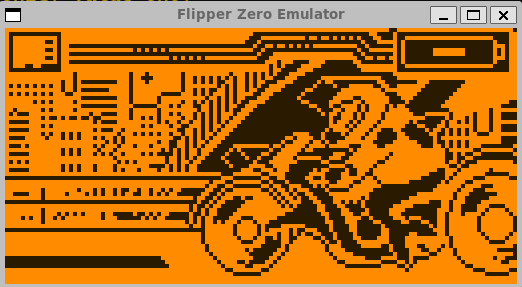
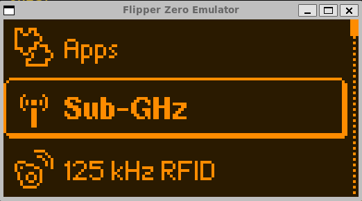
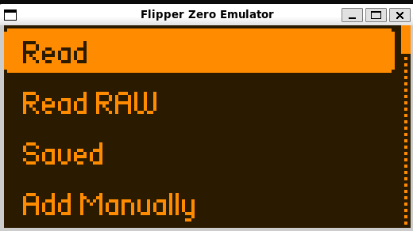

# Flipper Zero Full-System Emulator (STM32WB55RG)

Runs **real Flipper Zero firmware** on an emulated STM32WB55 chip using
[Renode](https://renode.io). It boots the actual firmware to the desktop,
renders the 128×64 display in a window, maps your PC keyboard to the Flipper
buttons, exposes the debug console over TCP, and logs every SubGHz/NFC/RFID
transaction — all **without any physical Flipper**.

Use it to develop and test firmware / FAP apps, or to inspect what the Flipper
*would* do on the radios (the RF signal itself is not emulated).

> **TL;DR**
> ```
> ./install.sh --with-firmware      # Linux: installs Renode + deps + firmware
> ./run.sh                          # boot the emulator
> ```
> On Windows, see [§ Windows step-by-step](#windows-step-by-step).

> **v3.1 status:** the real firmware **boots to the desktop**, the **SD card
> mounts**, the firmware **resources** (NFC/IR/SubGHz databases, app FAPs, dolphin
> animations) are laid onto the SD (so the **"No SD card / database" screen is
> gone**), and the **idle dolphin now animates** — an emulator patch fast-fails the
> un-emulated I2C bus so the FreeRTOS tick / software-timer daemon are no longer
> starved by battery-gauge busy-waits (this also makes boot much faster). All
> verified via the firmware's own log. `setup.sh` auto-provisions a 32 GB FAT32 SD
> with resources from `firmware/resources.ths` (needs the `heatshrink2` pip
> package, installed by `install.sh`). It requires the **RELEASE-mode**,
> `-DFLIPPER_EMULATOR`-patched firmware included in `firmware/`. Button → app-menu
> navigation is the one thing still being finalized. Full details are in
> **`DIAGNOSIS.md`** (§11 = animation/I2C fix, §10 = resources fix).

---

## Screenshots:

<div align="center">
  <br />
</div>
<div align="center">
  <br />
</div>
<div align="center">
  <br />
</div>

## Table of contents

1. [What you get](#what-you-get)
2. [How it works (30-second version)](#how-it-works)
3. [Linux / WSL2 — step by step](#linux--wsl2-step-by-step)
4. [Windows — step by step](#windows-step-by-step)
5. [Using the emulator (display, buttons, console)](#using-the-emulator)
6. [Patching ANY firmware for the emulator](#patching-any-firmware) ← **read this to run your own build**
7. [The full update (OTA) flow](#the-full-update-flow)
8. [Repository layout](#repository-layout)
9. [How it maps to real hardware](#how-it-maps-to-real-hardware)
10. [Limitations](#limitations)
11. [Troubleshooting](#troubleshooting)

---

## What you get

- **Full boot to the desktop.** The real firmware runs its true startup path
  (`furi_hal_init`, FreeRTOS, all services) and reaches the desktop with the
  dolphin. No debugger tricks, no manual ELF loading.
- **Display (ST7567).** SPI2 → 128×64 framebuffer → an SDL2 window (scaled 4×)
  or a headless ASCII/PNG view (great for WSL2 / SSH).
- **Buttons.** Arrow keys = D-pad, Enter = OK, Backspace/Esc = Back — injected
  as real GPIO edges that fire the EXTI interrupt like hardware.
- **Debug console.** The firmware's log/CLI on USART1 (230400) is exposed on TCP
  port 3456.
- **Radio stubs (CC1101 / ST25R3916 / LP5562).** Modelled on the SPI/I2C buses;
  they answer with plausible IDs and **log every transaction as JSONL** in
  `logs/`.
- **SD card + OTA scaffolding.** A 32 GB FAT32 image, a script to drop a real
  `./fbt updater_package` `.tgz` onto it, and an updater-boot script.

---

## How it works

Renode emulates the STM32WB55's Cortex-M4 and its peripherals. This project adds
the Flipper-specific parts that Renode doesn't ship:

- A **platform description** (`platform/stm32wb55_flipper.repl`) with the exact
  memory map and peripheral addresses of the Flipper's MCU.
- **Custom peripheral models** (`peripherals/`): the ST7567 display, the LP5562
  LED driver, the CC1101/ST25R3916 radios, a correct WB55 RCC (clocks), a
  correct WB55 EXTI (button interrupts), IPCC/HSEM/RTC/flash stubs, etc.
- A **launch script** (`scripts/flash_firmware.resc`) that wires it all together,
  loads the firmware, sets the buttons to "not pressed", and starts the CPU.

Two tiny things in the stock firmware don't survive functional emulation, so you
run a firmware built with a small **`-DFLIPPER_EMULATOR` patch** (see
[§ Patching](#patching-any-firmware)). Everything else is the real firmware.

---

## Linux / WSL2 step by step

Tested on Kali / Ubuntu / Debian. On WSL2 it works the same; for the GUI window
you need an X server (or just use the headless viewer).

**1. Get the code**
```bash
git clone <your-repo-url> flipper-emulator
cd flipper-emulator
```

**2. Install everything (one command)**
```bash
./install.sh --with-firmware
```
This downloads Renode into `./tools/renode/`, installs `dosfstools`, `mtools`,
Python + `PySDL2`/`Pillow`, downloads the latest official firmware into
`./firmware/`, and generates the machine-specific files.

> `--with-firmware` gives you the **stock** firmware. To actually boot to the
> desktop you need the **patched** build — see [§ Patching](#patching-any-firmware).
> A prebuilt patched firmware is in the backup zip if you were given one; drop it
> in `./firmware/` as `flipper-z-f7-full-EMULATOR-patched.bin`.

**3. Run it**
```bash
./run.sh
```
- An SDL window opens with the display (if PySDL2 + an X server are available).
- Console: `telnet localhost 3456`
- Give it ~30–45 s to reach the desktop (emulation is slower than real time).

**Headless (no window):**
```bash
./run.sh --no-gui &
python3 frontend/view_display.py --watch     # live ASCII view in the terminal
# or a PNG snapshot:
python3 frontend/view_display.py --png shot.png
```

---

## Windows step-by-step

Renode has a native Windows build, so you don't need WSL — but WSL2 is also fine
(follow the Linux steps inside WSL). Native Windows instructions:

**1. Install Renode for Windows**
- Download the Windows installer from <https://github.com/renode/renode/releases>
  (get **v1.16.1**, the `.msi` or portable `.zip`).
- Install it. The `Renode.exe` ends up in e.g.
  `C:\Program Files\Renode\bin\Renode.exe` (installer) or in the extracted folder
  (portable).

**2. Install Python 3** from <https://python.org> (tick "Add Python to PATH").
Then, in a terminal:
```
pip install PySDL2 pysdl2-dll Pillow
```

**3. Get this repo** (clone with git, or copy the folder from the zip).

**4. Generate the platform files for your machine.** The `.repl` uses absolute
paths, so run the setup once. In **Git Bash** or **WSL**:
```bash
./setup.sh
```
If you only have `cmd`/PowerShell and no bash, run this equivalent PowerShell
(from the repo folder) to generate the two files:
```powershell
$dir = (Get-Location).Path -replace '\\','/'
(Get-Content platform/stm32wb55_flipper.repl.in) -replace '@PROJECT_DIR@',$dir | Set-Content platform/stm32wb55_flipper.repl
(Get-Content scripts/run_updater.resc.in)        -replace '@PROJECT_DIR@',$dir | Set-Content scripts/run_updater.resc
```

**5. Put a patched firmware** in `firmware\` (see [§ Patching](#patching-any-firmware)),
named `flipper-z-f7-full-EMULATOR-patched.bin`.

**6. Launch Renode with the script.** Open Renode's console (run `Renode.exe`),
then in its monitor:
```
$firmware_bin=@firmware/flipper-z-f7-full-EMULATOR-patched.bin
include @scripts/flash_firmware.resc
```
Or from a terminal in the repo folder:
```
"C:\Program Files\Renode\bin\Renode.exe" -e "$firmware_bin=@firmware/flipper-z-f7-full-EMULATOR-patched.bin" -e "include @scripts/flash_firmware.resc"
```

**7. See the display.** The framebuffer is written to `%TEMP%\flipper_fb.raw`
(set `FLIPPER_EMU_FB_PATH` to change it). Run the viewer in another terminal:
```
set FLIPPER_EMU_FB_PATH=%TEMP%\flipper_fb.raw
python frontend\view_display.py --watch
```
Renode on Windows also has its own display/analyzer windows if you prefer.

> The `run.sh` launcher is a bash script (works in Git Bash / WSL). On plain
> Windows use the direct `Renode.exe` command above.

---

## Using the emulator

Once booted (wait for the dolphin desktop):

**Display**
- SDL window (scaled ×4), or `python3 frontend/view_display.py --watch` for a
  live terminal view, or `--png out.png` for a snapshot.

**Buttons** (via the SDL window, keys):

| Key            | Flipper button |
|----------------|----------------|
| Arrow keys     | Up / Down / Left / Right |
| Enter          | OK             |
| Backspace/Esc  | Back           |
| Q              | quit the frontend |

You can also inject buttons manually through Renode's monitor (TCP port 1234),
e.g. press OK (PH3, active-high): `gpioPortH OnGPIO 3 true` then
`gpioPortH OnGPIO 3 false`.

**Debug console (CLI):**
```bash
telnet localhost 3456        # or: nc localhost 3456, or PuTTY on Windows
```

**Radio logs:**
```bash
tail -f logs/cc1101.jsonl
tail -f logs/st25r3916.jsonl
```

---

## Patching ANY firmware

**This is how you run your own firmware build (or a newer version) in the
emulator.** You need to build the firmware with one extra define,
`FLIPPER_EMULATOR`, which is already wired into the source via the included
`firmware/flipper_emulator.patch`.

### Why a patch is needed

Under functional (not cycle-accurate) emulation, four things in the stock
firmware misbehave. The patch guards each with `#ifdef FLIPPER_EMULATOR`:

1. **Battery gauge / charger probe** — the stock code waits `furi_delay_us(4 s)`
   per failed I2C probe of chips that aren't emulated (minutes of wall-clock).
2. **SD card power bit-banging** — toggles the SPI pins as GPIO, which Renode
   can't translate.
3. **Tickless-idle deep sleep** — relies on an LPTIM wake IRQ that's unreliable
   under emulation and starves the button-input loop.
4. **Input debounce** — the gradual debounce needs precise timing; the patch
   makes it snap instantly (injected GPIO edges are already clean).

None of this changes the app logic — it's the real firmware.

### Step-by-step: build a patched firmware

You need the official firmware source and its build tool (`fbt`). On Linux/WSL:

**1. Clone the firmware (any version/tag you want):**
```bash
git clone --recursive https://github.com/flipperdevices/flipperzero-firmware
cd flipperzero-firmware
# optional: pick a release, e.g.  git checkout 1.4.3 && git submodule update --init
```

**2. Apply the emulator patch:**
```bash
git apply /path/to/flipper-emulator/firmware/flipper_emulator.patch
```
If `git apply` complains (the source moved between versions), apply it manually —
the patch only adds `#ifdef FLIPPER_EMULATOR` blocks in 3 files:
`targets/f7/furi_hal/furi_hal_sd.c`, `targets/f7/furi_hal/furi_hal_power.c`, and
`applications/services/input/input.c`. Open the `.patch` file; it's short and
readable.

**3. Build with the define — in RELEASE mode (`DEBUG=0`):**
```bash
./fbt DEBUG=0 --extra-define=FLIPPER_EMULATOR updater_package
```
First run downloads the ARM toolchain (~300 MB) automatically.

> **`DEBUG=0` is required.** This firmware version phased out internal storage
> (`/int`), so a debug build hits `furi_assert(type == ST_EXT)` and crashes on
> boot when the desktop reads its settings. Release mode disables `furi_assert`,
> matching real hardware. The release build lands in `dist/f7/` (no `-D` suffix).
> The patch also spans more files now — see `DIAGNOSIS.md` §9 for the full list.

**4. Grab the result and drop it into the emulator:**
```bash
cp dist/f7/flipper-z-f7-full-local.bin \
   /path/to/flipper-emulator/firmware/flipper-z-f7-full-EMULATOR-patched.bin
```

**5. Run it:**
```bash
cd /path/to/flipper-emulator
./run.sh
```
`run.sh` automatically prefers any firmware whose name contains
`EMULATOR...patched`. To run a specific file: `./run.sh firmware/whatever.bin`.

> **Building your own FAP app?** Build it normally with `./fbt fap_yourapp`, put
> the `.fap` on the SD image (`scripts/prepare_sdcard.py`), and it will appear in
> the Apps menu — no emulator patch needed for the app itself, only for the base
> firmware.

---

## The full update flow

Reproduces the "insert SD with the update and the Flipper flashes itself" flow.

```bash
# 1. Build the update package (or download flipper-z-f7-update-<ver>.tgz)
./fbt updater_package            # in the firmware source; makes dist/.../*.tgz

# 2. Prepare a 32 GB SD image with it and boot into the updater
cd /path/to/flipper-emulator
./run.sh --with-update /path/to/flipper-z-f7-update-<ver>.tgz
```
`prepare_sdcard.py` unpacks the `.tgz` into `/update/<version>/` on the FAT32
image and writes the `/.fupdate` pointer, exactly like qFlipper.
`scripts/run_updater.resc` sets the RTC boot mode to *Update* so `main()` takes
the `flipper_boot_update_exec()` path. You can validate a manifest out of band:
```bash
python3 scripts/fus_stub.py /path/to/extracted/f7-update-<ver>/
```

> The SD-over-SPI path is experimental (see [Limitations](#limitations)). The
> normal desktop + apps do **not** need the SD to run.

---

## Repository layout

```
flipper-emulator/
├── install.sh                      # one-shot dependency installer (Linux)
├── setup.sh                        # regenerates machine-specific files from *.in
├── run.sh                          # launcher (bash: Linux / WSL / Git Bash)
├── platform/
│   ├── stm32wb55_flipper.repl.in   # TEMPLATE (tracked); .repl is generated
│   └── stm32wb55_flipper.repl      # generated by setup.sh (gitignored)
├── peripherals/
│   ├── rcc_wb55.py  pwr_wb55.py  rtc_wb55.py  syscfg_wb55.py
│   ├── hsem_wb55.py  ipcc_stub.py  rng_wb55.py  flash_controller_wb55.py
│   ├── adc_stub.py  aes_stub.py  pka_stub.py  usb_stub.py  generic_stub.py
│   ├── STM32WB55_EXTI.cs           # correct WB55 EXTI (makes buttons work)
│   ├── LP5562.cs                   # RGB LED / backlight (I2C)
│   ├── ST7567.cs                   # display controller (SPI2 -> framebuffer file)
│   ├── CC1101.cs  ST25R3916.cs     # radio stubs + JSONL logging
│   ├── FlipperSdCard.cs            # SD-SPI card model
│   └── Spi1Router.cs  Spi2Router.cs# SPI chip-select multiplexers
├── frontend/
│   ├── sdl_frontend.py             # SDL2 window + keyboard -> buttons
│   └── view_display.py             # headless ASCII / PNG viewer
├── scripts/
│   ├── flash_firmware.resc         # main launch script
│   ├── run_updater.resc(.in)       # OTA update flow
│   ├── prepare_sdcard.py           # build the 32 GB FAT32 SD image
│   └── fus_stub.py                 # validate update.fuf manifest
├── bootrom/dfu_bootloader_stub.py  # boot-mode (Normal/DFU/Update) helper
├── firmware/                       # put your *.bin here + flipper_emulator.patch
├── tools/                          # Renode (downloaded by install.sh; gitignored)
├── sdcard/                         # 32 GB FAT32 image (gitignored)
└── logs/                           # radio JSONL logs (gitignored)
```

---

## How it maps to real hardware

Addresses/pins come from the real firmware, not guesses:

| Function | Pin | Notes |
|---|---|---|
| Buttons Up/Down/Left/Right/Back | PB10 / PC6 / PB11 / PB12 / PC13 | active-low, pull-up |
| Button OK | PH3 | active-high, pull-down |
| Display (ST7567) | SPI2, CS=PC11, D/C=PB1, RST=PB0 | 4 MHz, flip mode, x_offset 4 |
| SD card | SPI2, CS=PC12, CD=PC10 | shared bus with display |
| CC1101 (SubGHz) | SPI1, CS=PD0 | 8 MHz |
| ST25R3916 (NFC) | SPI1, CS=PE4 | 8 MHz |
| LED/backlight (LP5562) | I2C1 @ 0x30 | |
| Debug UART | USART1 TX=PB6 RX=PB7 | 230400 |

Emulator-side fixes (no firmware change): custom WB55 **RCC** (oscillator ready
flags mirror enable bits) and custom WB55 **EXTI** (correct register layout so
button interrupts fire).

---

## Limitations

- **No RF.** SubGHz/NFC/RFID/IR are functional stubs with logging — not
  signal-accurate. Not a substitute for hardware validation of RF timing.
- **No BLE / Thread.** The Core2 (M0+) radio stack is a closed ST blob. The
  IPCC/HSEM mailbox is stubbed; `furi_hal_bt` times out after 1 s and degrades
  gracefully (no crash). BT shows as unavailable.
- **Boot is slower than real time** (~30–45 s to the desktop). Be patient.
- **Button → menu navigation is timing-sensitive.** Button GPIO edges fire the
  EXTI and the input events are published, but delivering them to the active GUI
  view depends on the emulated scheduler timing and is currently not 100%
  deterministic. Boot + display are solid; UI navigation may need a few tries.
- **SD over SPI is experimental / not required for the UI.** Desktop, menu and
  apps run from flash. The SD (32 GB image + `FlipperSdCard.cs`) is wired for the
  OTA flow but a clean FAT32 mount shared with the display on SPI2 is still flaky
  in this Renode version. The main `flash_firmware.resc` runs with the display
  alone on SPI2 (SD absent) — the reliable configuration.
- **Requires the `FLIPPER_EMULATOR`-patched firmware** to boot fully (see above).

---

## Troubleshooting

- **No window on WSL2 / SSH** → use `./run.sh --no-gui` +
  `python3 frontend/view_display.py --watch`, or start an X server and
  `export DISPLAY=...`.
- **"Renode not found"** → run `./install.sh` (Linux), or set `RENODE_PATH` to
  your Renode folder, or on Windows call `Renode.exe` directly.
- **Moved the repo / cloned fresh** → run `./setup.sh` (regenerates the absolute
  paths in the `.repl` and updater script). `run.sh` does this automatically if
  the generated files are missing.
- **Boots to a "DFU" screen** → a button reads as pressed. Make sure the launch
  script set the buttons idle (it does by default); on a custom setup drive
  PB10/PB11/PB12/PC6/PC13 high and PH3 low before `start`.
- **Reboot loop / `furi_crash`** → run with `logLevel -1` and
  `sysbus LogAllPeripheralsAccess true` to trace, or check you're using the
  patched firmware.
- **Slow boot** → normal; the full RTOS runs functionally. Wait 30–45 s.
</content>
